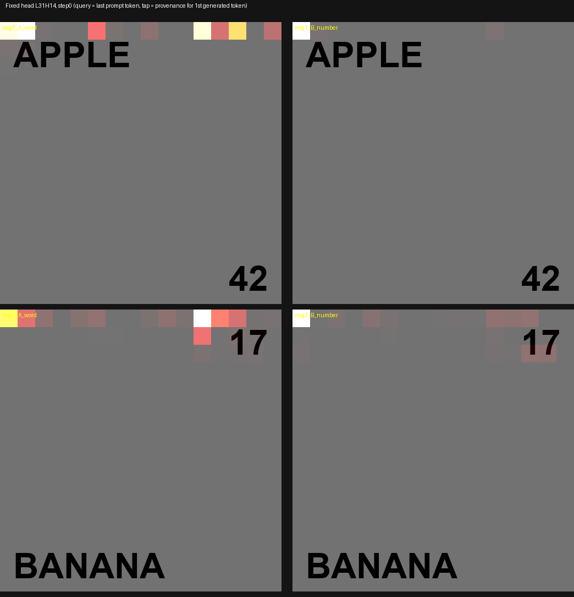
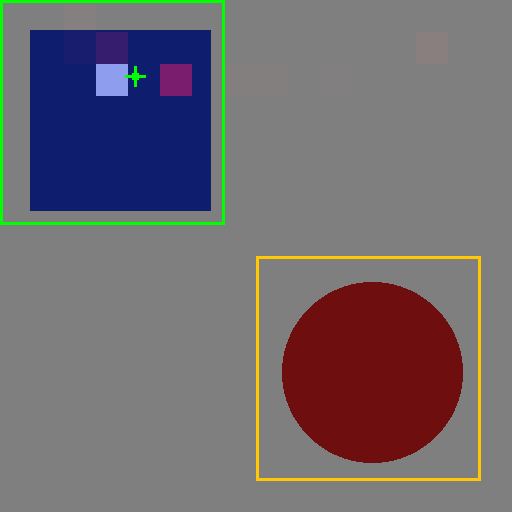
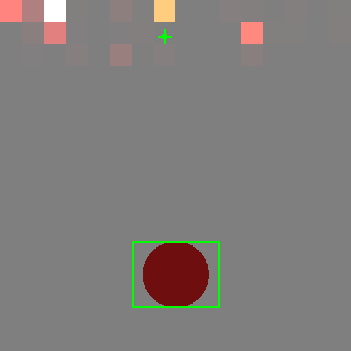

# Image Lens Probe — prefill does decode's job for images (2026-08-31)

**Status: one branch closed cleanly, one branch open and cheap to test.** This
is not "attention can't do image provenance." It is narrower and more
interesting: **the existing decode-time attention tap does not extend to
images, and the reason is mechanistic** — for images, prefill resolves the
content before decode ever starts, so the decode tap is reading after the
fact. The text lens works because a short prompt genuinely retrieves from
context at decode time; a short prompt over an image mostly does not. One
scoped branch (tapping prefill instead of decode) remains untested and is
written up at the end for someone to pick up cold.

Three rounds, same engine tap the text lens uses
(`ForwardPassBase::set_attention_taps` / `mark_attention_taps` /
`get_attention_taps`), pointed at image soft tokens instead of text tokens for
the first time. Qwen 3.6-35B-A3B Q2_K_XL + its mmproj, `--flash-attn` off,
single slot, greedy.

## The central finding

The vision encoder resolves the image, prefill folds it into the residual
stream, and by the time the answer token is decoded the content is already
present in the hidden state — decode attention back over image patches is
largely vestigial. This is the same tap, the same math, that grounds the text
lens; it simply arrives too late in the image case, because prefill already
did the retrieval decode does for text.

**The direct consequence for the receipts doctrine:** in round 3, the model
answered correctly from a page region the decode tap never visited (target
mass exactly 0.000 at rows 4, 8, 12 of 16 — see below). A coverage or omission
claim built on the decode tap would report "this region was never consulted"
about a region the model demonstrably used. That is a false negative on the
omission report, which `docs/market-probe-qemmi-lens.md` identified as the
lens's only unique asset — and a silently wrong coverage claim is worse than
no claim. **This is why the decode tap must not be extended to images
as-is.**

## Round 1 — confounded null

Page with "APPLE" in one corner, "42" in another; prompts *"what word is
shown?"* / *"what number is shown?"*. Attention sat in the first row of the
image span and never moved with the question. But **the model could not read
the page** — it answered "SUN", "black", "4", "0", and did so in the plain
vision smoke too, so this is a Q2_K_XL glyph-legibility limit, not a tap bug
and not the historical qwen36 vision-ordering defect. Asking where a model
looked while it was failing to see cannot be distinguished from the
interesting null.

**Lesson: a perception gate must precede any attention interpretation** — the
same discipline the text lens already applies, where citations are only
produced for values actually extracted.

## Round 2 — real discrimination, and a ceiling

Switched from OCR to colour/shape, which survives heavy quantization where
glyphs do not: a red circle and a blue square in opposite corners, prompts
*"what colour is the circle?"* / *"what colour is the square?"* — same
phrasing shape, neither naming a position, so attention cannot be steered by
the prompt's wording alone.

Perception gate passed on all four (red, blue, red, blue). About **10 of 160
(layer, head) pairs** locked tightly onto the *referenced* object with ~0.00
mass on the distractor — target mass 0.73–0.95. That is discrimination, not
saliency: the head is following which object the question names, not just
where ink is.

But mass below the middle of the page was **exactly 0.0000** everywhere, and
both wins had their target in the top rows — the ceiling that rounds 3
pins down.

## Round 3 — the ceiling is absolute

**Same-row swap.** Both objects placed in the same row band, so depth from
the sink is equal and any left↔right movement in a head's attention is pure
object-following. **FAIL against the pre-committed bar.** Four of five
known-good heads flip correctly between the two questions within one image —
so the heads are not blindly position-locked — but two heads **invert** on
the swapped layout, attending to the distractor over the target (worst case
0.021 target / 0.977 distractor). Only **L31H4** tracked cleanly across all
four combinations.

| head | A1 circle-Q | A1 square-Q | A2 circle-Q | A2 square-Q |
|---|---|---|---|---|
| L27H6 | 0.458 / 0.498 | 0.888 / 0.068 | 0.874 / 0.112 | 0.972 / 0.017 |
| L35H2 | 0.878 / 0.081 | 0.835 / 0.078 | 0.643 / 0.312 | 0.914 / 0.065 |
| L39H8 | 0.783 / 0.139 | 0.676 / 0.195 | **0.173 / 0.796** | 0.902 / 0.053 |
| L23H12 | 0.641 / 0.354 | 0.907 / 0.091 | **0.021 / 0.977** | 0.998 / 0.002 |
| L31H4 | 0.937 / 0.021 | 0.940 / 0.003 | 0.910 / 0.054 | 0.822 / 0.076 |

(target mass / distractor mass, sink-excluded)

**Depth sweep.** One circle, same column, at grid rows ~1, 4, 8, 12 of 16.
Target mass is **exactly 0.000 at rows 4, 8 and 12 — all five heads, no
exceptions.** When the object sits at row 12, the surviving non-sink mass
does not drift toward it; it sits in rows 1–2, the same place as when the
object is at row 1. The heads are not failing to *find* the object at depth —
they never look past row 2 regardless of what is there. Reach is ~2 rows of
16, roughly 12% of the page, and it is content-independent.

**The model answered "red" correctly at every depth, including row 12.** So
this is cleanly an attention-reach ceiling, not a perception failure — the
gate passed every time.

| depth (row) | answer | mean target mass (5 heads) |
|---|---|---|
| 1 | red (correct) | 0.711 |
| 4 | red (correct) | 0.000 |
| 8 | red (correct) | 0.000 |
| 12 | red (correct) | 0.000 |

## Methodology worth keeping

This outlives the negative result — it is the reusable part.

- **Positional sink.** Row 0 of the image span carries 65–67% of image-span
  mass, analogous to the documented BOS sink. Any real signal must be
  measured with it excluded.
- **Raw concentration rankings are fooled** by a second, sink-adjacent row
  band. The honest metric is row-controlled: within only the rows the object
  occupies, what fraction of that band's mass falls in the object's columns,
  against chance = object_width/grid_width. Population mean across 160 heads
  was **0.377 against chance 0.4375** — most heads show row bias, not column
  selectivity. Only ~6% clear it.
- **Perception gate first.** Never interpret attention for a case the model
  got wrong.
- **Synthetic images give ground truth for free**, which is why image probes
  are far cheaper to score than the text-lens campaigns were. That advantage
  survives this result and applies to anything picked up later.
- **The question ladder.** All three rounds sat on rung 1 — *locate a visible
  thing* — chosen for scoreability, not value, and it is the rung a
  conventional OCR pipeline already wins outright. Rung 2 is *select among
  candidates* ("what is the total?" on a page of six numbers — OCR finds all
  six and cannot say which the model used). Rung 3 is *inferential and
  absent* ("is this overdue?"; "what is the VAT number?" when there is none)
  — nothing to point at, so attention is the only possible signal, and it is
  where the omission report lives. **Anything resumed later should start at
  rung 2, not rung 1.**

## The open branch — tap prefill attention

Not simply "the same tap, earlier." It differs in three ways that matter:

- **Different shape of evidence.** The decode tap reads one query row.
  Prefill attention is the full n×n matrix, so a provenance claim requires
  aggregating across query positions and layers — and that aggregation
  (rollout, attention flow) is contested ground in the literature. The lens's
  existing non-claims contract ("consideration, not commitment",
  `docs/lens-format.md`) was calibrated for a single-row read; a
  rollout-derived claim is a different epistemic object and needs its own
  boundary drawn from scratch, not inherited.
- **Not the obvious continuation.** What was already tapped in rounds 2–3 is
  the query at the last prompt token — effectively prefill's final row — and
  it showed the ceiling above. What prefill would add is the *earlier* rows
  and the image span attending to itself. That is genuinely untested.
- **Cost lands in the worst place.** Prefill flash attention is worth
  roughly 30–55% at the prompt lengths documents produce, and a prefill tap
  forfeits it because flash never materializes the matrix. `architecture.md`
  §11 currently calls the speed-vs-receipts conflict "theoretical inside the
  envelope" (decode is one query row × ≤10K keys, so fusion buys nothing
  there today). A prefill tap would make that conflict real, expensive, and
  concentrated precisely on the document workload the lens targets. Flag it
  as a decision for the architect, not a detail to fold in quietly.

**The cheap test that settles it without building the instrument:** do not
export the matrix. Reduce it on device — sum each layer's prefill attention
over all query rows into the image span, giving one vector per layer. Small
tensor, no firehose, no flash-attention forfeiture to commit to up front. It
answers the only question that currently matters: **does any prefill row
reach past row 2, or is the ceiling universal?** If the ceiling holds there
too, the idea is closed for good. If it does not, prefill is where an image
lens would live.

## Honest limits

- One model, one quant (Q2_K_XL), one decode step.
- Only 10 of 41 blocks were tapped (every fourth is a full-attention layer;
  the DeltaNet/MoE layers between them were never tapped and could behave
  differently).
- Grid geometry was validated visually against glyph positions in round 2,
  but only in the band where mass exists — mildly circular.
- Round 3's depth-sweep objects were smaller (96px) than round 2's (180px)
  and sat in a slightly different column.

## Repro artifacts

Harnesses (`probe_image_lens*.cpp`, `analyze*.py`, `make_images*.py`) and the
full figure set lived in a session-scoped scratchpad and were not committed —
only the three decisive figures above were copied into the repo. Nothing else
here needs sourcing beyond this note; no numbers were re-run.
